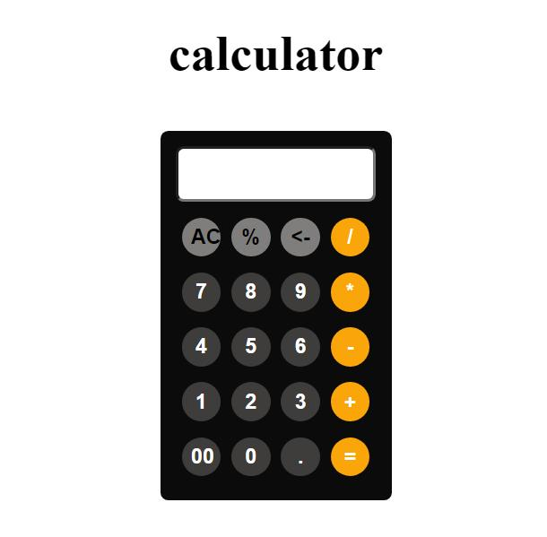

# 🧮 Simple Calculator Web App

A clean and simple **Calculator Web Application** built using **HTML, CSS, and JavaScript**. It performs basic arithmetic operations with a user-friendly interface.

---

## 🚀 Features

- ➕ Addition  
- ➖ Subtraction  
- ✖️ Multiplication  
- ➗ Division  
- 📊 Percentage calculation  
- 🧹 Clear All (AC)  
- ⌫ Delete (Backspace)  
- 🔢 Decimal support  

---

## 🛠️ Technologies Used

- HTML5  
- CSS3  
- JavaScript  

---

## 📂 Project Structure

- calculator-project/
- │── index.html
- │── calculator-css.css
- │── calculator-js.js
- │── README.md

---

## 💡 How It Works

- Click buttons to enter numbers and operations  
- The `calculate()` JavaScript function processes input  
- Results are displayed on the screen  
- Press `=` to evaluate  

---

## 📸 Screenshot

  

